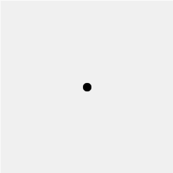
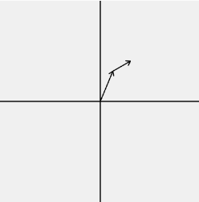
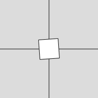
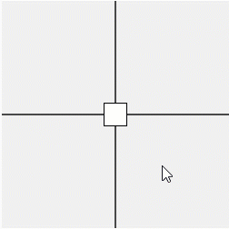

# Mathemagical.js
A p5.js library for programming web-based mathematical figures, animations, and interactives in 2D and 3D. Designed for math learners, math educators, and math creators.

## Why this project?
Math concepts are easier to understand when we can see them in motion and interact with them. Today, it’s possible for mathematicians and educators to share what they see in their minds by writing programs with a software library.

Software libraries are more versatile than software applications, and they open more doors, since learning to use them means learning to program. Unfortunately, existing libraries for math graphics are inaccessible to most of the math community, due to their complexity.

To bridge this gap, we propose Mathemagical.js: a software library that makes it easier to program web-based mathematical figures, animations, and interactives in 2D and 3D (like the ones in this [demo video](https://youtu.be/Br40z-lpC3o)). To make it intuitive enough for beginners and flexible enough for experts, we are building on [p5.js](https://github.com/processing/p5.js/tree/main), which has already managed this feat in the visual arts.

## Who’s behind it?
This is an open-source, community-driven project. **_You can join our mailing list by filling out the [Mathemagical.js community form](https://docs.google.com/forms/d/e/1FAIpQLScmVUW9doOZlzCN7k-P5XqKIGUIx_tWplqUySZSneT7IelDKA/viewform)._**

We plan to follow the [All Contributors specification](https://allcontributors.org/) and will set this up soon; for now, we include a description of early contributions here: 

* [@GregStanton](https://github.com/GregStanton) proposed the library and leads the project.
* [@tfadali](https://github.com/tfadali) has provided regular feedback and thoughtful discussion about design choices.
* [@jesi-rgb](https://github.com/jesi-rgb) designed [the site for our initial proposal](https://fellowship-proposal.vercel.app/en), provided expertise, and named the project.
* Many others have provided feedback, made helpful suggestions, and shared our work on social media.

## How to contribute?
You can start by reading [our interface proposal](#interface-proposal-sample-features). If you like, you can also try out a prototype of the Mathemagical.js library. Either way, we welcome your feedback!

* **Trying out the library:** You can tinker with the examples in the interface proposal, or you can start a new sketch by opening [this project](https://editor.p5js.org/highermathnotes/sketches/-sf5v47pO) in the p5.js Web Editor; any Mathemagical code you type into the editor will automatically work (the index.html file imports the prototype library).

* **Sharing feedback:** If you want to start a [discussion](https://github.com/Mathemagical-Community/Mathemagical.js/discussions) by asking a question or sharing an idea, that would be super helpful! If you want to start an [issue](https://github.com/Mathemagical-Community/Mathemagical.js/issues) that's likely to result in action items, that would also be great! If you're not sure whether to start a discussion or an issue, flip a coin. We can convert one to the other if needed.

**_Note: Many features have not been implemented yet, and during this prototype phase, some code may not work as expected._**

# Interface proposal: Sample features
Here, we outline an initial design of the Mathemagical environment, which supports drawing, animation, and interaction. We focus specifically on what the user will see, and we illustrate each type of feature with a minimal selection of examples. For instance, we show how to draw an arrow as an indication of how other shapes can be drawn. We also include links to demos that you can run in the browser, based on a [prototype library](mathemagical-prototype.js).

For the purposes of this proposal, we do assume basic familiarity with computer programming; we need to be confident our design will work at all before we can test whether it will be intuitive to beginners. If you're wondering about the rationale for our design decisions, or other details, you can check out the [Mathemagical.js wiki](https://github.com/Mathemagical-Community/Mathemagical.js/wiki).

## Environment
Mathemagical extends p5’s graphical environment by introducing custom **graph windows**. Beyond allowing the user to work within a right-handed coordinate system if desired, this allows the user to

* specify the origin, axis orientations, units of length, and scale (e.g. linear or logarithmic) 
* provide custom dimensions for graph windows that occupy only part of the canvas
* create multiple graph windows per canvas (e.g. for side-by-side plots or scenes)
* work within non-Cartesian coordinate systems

Graph windows are created and used like canvas elements and graphics buffers in p5. In particular, p5 functions like `stroke()` and `point()` continue to work as usual.

### Prototype demo

In this <a href="https://editor.p5js.org/highermathnotes/sketches/R2Ky3wFhl">demo of a Mathemagical graph window in the p5.js Web Editor</a>, we draw and style a point in a custom coordinate system using native p5 syntax.

### Graph windows
```
w = createCartesianWindow(...) //similar to c = createCanvas(...) in p5
w = createPolarWindow(...)
w = createCylindricalWindow(...)
w = createSphericalWindow(...)

w.background(...) //draw graph window by coloring its background
w.border(...) //CSS-like window border (e.g. supports rounded corners)
```

### Example functions
```
w.stroke(...) //set stroke color
w.rotate(...) //apply a transform
w.mousePressed(...) //respond to an event

w.point(x, y) //draw a point
w.point(v) //here, v is a p5.Vector object
```

## Drawing
In addition to custom graph windows, Mathemagical provides **drawing objects** that encompass both primitive shapes and composite shapes:

* Primitive shapes: points, lines, graphs of mathematical functions, etc.
* Composite shapes: axes with tick marks, vector fields, styled data tables, etc.

In general, drawing objects are any objects that can be rendered on the canvas. (Mathemagical's drawing objects are analogous to Manim's ["mobjects."](https://docs.manim.community/en/stable/tutorials/building_blocks.html#mobjects))

This object-oriented approach makes it easy to modify individual pieces of complicated objects, all within a single interface that’s consistent with p5’s. Specifically, the user creates an object with a method like `w.createAxis()`, and then they draw it with a method like `w.axis()`. (Internally, `w.axis()` invokes an axis object’s own render method.)

### Prototype demo

In this <a href="https://editor.p5js.org/highermathnotes/sketches/vtp-XYsHy">demo of a Mathemagical drawing object</a>, we draw basic arrows, which are not directly provided by p5.

### Example objects
```
myGrid = w.createGrid(...) //store subdivisions per tick, etc.
w.grid(myGrid) //draw grid determined by w

myAxis = w.createAxis(...) //store arrow type, etc.
myAxis.tick(-PI).stroke(...) //adjust color of the tick at -PI
w.axis(myAxis) //draw axis with tick marks and labels

myPoint = w.createPoint(...) //takes same parameters as p5’s point()
w.point(myPoint) //draw a point; has same effect as w.point(x, y) and w.point(v)

myArrow = w.createArrow(...) //create a Mathemagical arrow
w.arrow(myArrow)

//since p5 already has createVector(),
//Mathemagical provides .vector() in addition to .point() and .arrow()
myVector = w.createVector(...)
myVector.vectorMode(mode) //mode = POINT or ARROW (optional)
w.vector(myVector) //uses ARROW mode by default
```

### Example customizations
```
myGrid.stroke(...)
myPoint.set(...) //takes same parameters as createPoint(), for updates
myLine.rotate(...)
```

## Animation
In addition to drawing objects, Mathemagical provides **animation objects**:

* fade-in animations
* tracing animations
* rotation animations
* animated color changes 
* homotopies that transform one object into another
* etc.

In general, animation objects store any time-dependent sequence of changes to the rendering of a drawing object. Each of them may be applied to various kinds of drawing objects. For example, a rotation may be applied to a rectangle, a line, or any other shape. 

Just as p5's built-in shapes make it easier to make complex drawings, Mathemagical's built-in animation objects make it easier to make complex animations. They can be customized by adjusting speed and other properties, just as p5 shapes can be customized by adjusting color, position, etc.

### Prototype demo

In this <a href="https://editor.p5js.org/highermathnotes/sketches/kzMBS4uF0">demo of a Mathemagical animation object in the p5.js Web Editor</a>, we make a square rotate in time.

### Example objects
```
myLine = w.createLine(...) //drawing object
myRotation = w.createRotation(...) //animation object
myLine.takeUpdate(myRotation) //take update instructions from myRotation
w.line(myLine) //draw updated line
```

### Example customizations
```
myRotation.speed(...) //set rotation speed
```

## Interaction
In addition to drawing objects and animation objects, Mathemagical provides **interaction objects**, which leverage web-based interaction events. Like animation objects, there are many possible interaction objects:

* clickables
* draggables
* zoomables
* etc.

In general, interaction objects store any interaction-dependent changes to the rendering of a drawing object. In particular, they allow the user to customize both the detection and response to user interactions. Like animation objects, each interaction object can be applied to different drawing objects; this makes it easy to create clickable rectangles or ellipses, draggable points or lines, zoomable or pannable graph windows, and so on.

### Prototype demo

In this <a href="https://editor.p5js.org/highermathnotes/sketches/nI_tO_XV8">demo of a Mathemagical interaction object in the p5.js Web Editor</a>, we make a square draggable.

### Example objects
```
myPoint = w.createPoint(...) //drawing object
myDraggable = w.createDraggable(...) //interaction object
myPoint.takeInput(myDraggable) //take user input from myDraggable
w.point(myPoint) //draw point based on user input
```

### Example customizations
```
//event listeners (e.g. for customizing a hover radius)
myDraggable.setObjectIsHovered(myCallback)

//event handlers (consistent with p5’s p5.Element API)
myDraggable.objectHovered(myCallback)
```
